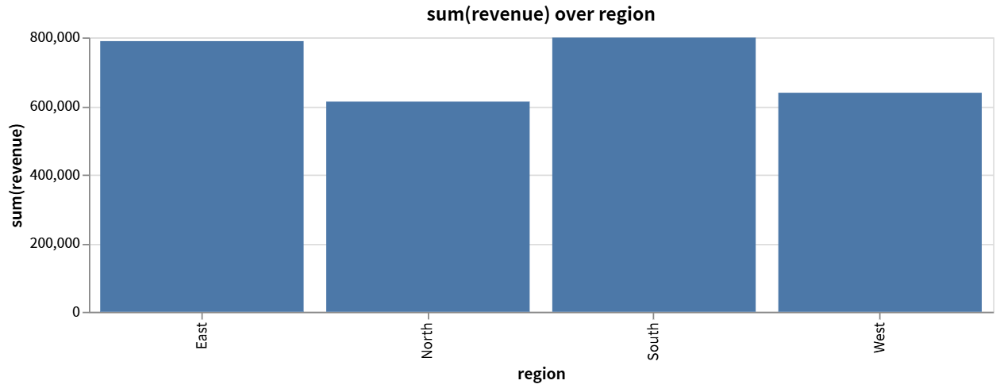
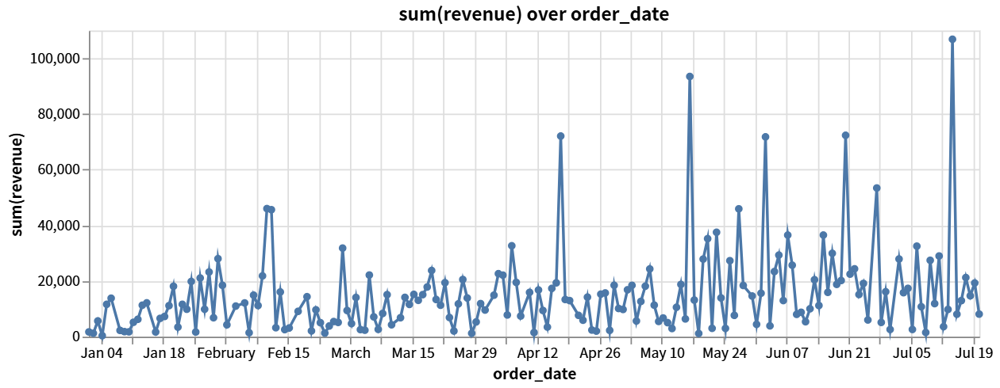

<h1 align="center">OpenAnalyst</h1>

<p align="center"><b>Turn your coding agent into a data analyst.</b><br/>
Attach a CSV, get an automatic profile, ask questions in SQL, and see real charts rendered inside the conversation.</p>

<p align="center">
  <a href="LICENSE"></a>
  
  
  
</p>

<p align="center">English · <a href="README.zh.md">中文</a></p>

Charts rendered live inside a DeepSeek Harness conversation (exported straight
from the session — see [the verification record](docs/VERIFICATION.md)):

<p align="center">
  
  
</p>

> Status: **M1 + M2 + M3 complete.** The dsh plugin is live-verified inside
> `dsh web 0.1.0-rc.8` — the full attach → profile → query → chart chain ran in
> a real session and both charts rendered as conversation nodes
> ([verification record](docs/VERIFICATION.md)). The MCP server passes
> protocol-level tests plus a stdio smoke. See [Known limitations](#known-limitations).

---

## What it does

```
data_attach     →  register a CSV / Parquet / JSON / XLSX file as a queryable table
data_attach_db  →  attach PostgreSQL / MySQL / SQLite read-only and list its tables
data_profile    →  types, missing values, exact distinct counts, outliers, quality issues, chart ideas
data_query      →  one read-only SQL statement, results as lossless JSON
data_chart      →  a Vega-Lite chart drawn in the conversation (dsh) or rendered to SVG (MCP)
data_report     →  a self-contained HTML report (profile + charts as inline SVG); prints to PDF
data_sources    →  what is currently attached
```

The same five tools ship on two hosts from one engine:

| Host | Package | Chart delivery |
|---|---|---|
| DeepSeek Harness plugin | `openanalyst` | live conversation node (Vega canvas) |
| MCP server (Claude Code / Codex / Cursor / any MCP client) | `openanalyst-mcp-server` | SVG file + full Vega-Lite spec in `structuredContent` |

Every tool is also reachable from Code Mode as `await tools.data_*(args)`, so
the agent can chain the whole analysis inside one program instead of spending a
round trip per step.

## Install

DeepSeek Harness:

```bash
dsh plugin --profile web add openanalyst
```

Claude Code (or any MCP client, via stdio):

```bash
claude mcp add openanalyst -- npx -y openanalyst-mcp-server
```

## Architecture

Three decisions shape the codebase.

**The engine knows nothing about the harness.** `@openanalyst/core` takes paths
and SQL and returns lossless JSON. It imports no dsh, MCP, or CLI type. That is
what lets the same analysis ship to Claude Code, Codex, and Cursor through an
MCP adapter later without a second implementation — the single largest factor
in whether a plugin reaches an audience beyond one host.

**DuckDB does the statistics.** `SUMMARIZE` returns min/max/avg/std/quartiles/
approx_unique/null_percentage for every column in one pass, and reads CSV,
Parquet and JSON directly with full-file type inference. Only IQR outliers,
duplicate-row detection, and the judgement about what is worth flagging are
written by hand.

**Charts are Vega-Lite specs carried on session events.** The harness tool-card
kinds are a closed set — `generic`, `terminal`, `diff`, `search`, `web` — with
no chart member, so a tool result can only ever degrade a chart to text. A real
chart has to come from a *conversation node*, which the client half registers.

That constraint turned out to pick the chart format too. A conversation node
must rebuild its view as a **pure function of durable events** — no clock, no
random, no live state — and the engine prefers whole-value checkpoints over
deltas. A Vega-Lite spec with its data inlined is exactly that: one plain JSON
value that replays byte-for-byte. Vega-Lite was chosen because it satisfies the
replay rule, not because it is a popular chart library.

```
@openanalyst/core            engine, profiling, DB connectors, chart specs  (host-agnostic)
  ├── @openanalyst/report    Vega-Lite -> SVG (pure JS) + self-contained HTML reports
  ├── openanalyst            dsh host half: 7 tools + chart event
  │     └── ./client         dsh browser half: conversation node + Vega canvas
  └── openanalyst-mcp-server stdio MCP server: same 7 tools, charts as SVG files
```

## Development

```bash
pnpm install
pnpm -r run build
pnpm -r run test
```

74 tests: 46 over the core (SQL policy, JSON conversion, profiling with exact
distinct counts, charts, and live PostgreSQL/MySQL connector tests that
auto-skip without the Docker fixtures), 5 over the report builder, 14 driving
the real dsh plugin tools end to end against DuckDB (including per-agent
isolation), and 9 protocol-level MCP tests over the SDK's in-memory transport
(plus a scripted stdio smoke). Live verification against a running `dsh web` is scripted in
`scripts/mock-llm-scripted.mjs` + `scripts/verify-live.patch.yml` — see
[docs/VERIFICATION.md](docs/VERIFICATION.md).

## Known limitations

These are real and worth reading before building on this.

- **PTC 模式 (Code Mode) presets reject direct tool calls** — the model must
  wrap them in a `run_code` program there. Under the Standard preset the tools
  are called directly. Verified behavior, documented in
  [docs/VERIFICATION.md](docs/VERIFICATION.md).
- **dsh per-agent engines are bounded, not lifecycle-tracked.** Each dsh agent
  session gets its own engine (no alias collisions), but the harness does not
  notify plugins on agent disposal, so the plugin holds at most 32 engines and
  evicts the least-recently used — that session transparently re-attaches on
  its next call.
- **The client bundle is ~860 kB.** Vega is inlined because the harness serves
  exactly one file per plugin and has no route for sibling chunks, so a
  chart-free session still pays for it.
- **`data_attach` takes any path the host process can read.** There is no
  workspace fencing yet; it inherits whatever the harness sandbox allows.
- **XLSX depends on DuckDB's `read_xlsx`**, which may need an extension
  download on first use. CSV, Parquet and JSON are covered by tests; XLSX is
  not.

## Notes on the dsh npm packages

Two things cost time here and are worth recording for anyone else building a
harness plugin:

- **`latest` points at a broken line.** `npm view @deepseek-ai/dsh-tools
  version` reports `0.0.1-rc.1`, but the current line is `0.1.0-rc.8`. Several
  `0.0.1-rc.1` packages cannot be installed at all —
  `@deepseek-ai/dsh-client-runtime@0.0.1-rc.1` depends on
  `@deepseek-ai/dsh-compact` and `@deepseek-ai/dsh-session@0.0.1-rc.1` depends
  on `@deepseek-ai/dsh-type-meta`; neither is published. Pin `0.1.0-rc.8`.
- **pnpm's `minimumReleaseAge` policy blocks the rc line** while it is fresh.
  This repo lifts it in `pnpm-workspace.yaml`, with a note to restore it once
  dsh has a stable release.

## Roadmap

| | |
|---|---|
| **M1** | Core + dsh plugin, charts in the conversation — done, live-verified |
| **M2** | MCP server: same capability in Claude Code / Codex / Cursor — done ← *you are here* |
| **M3** | HTML report export (prints to PDF), PostgreSQL / MySQL / SQLite, per-agent isolation — done |
| **M4** | Workbench panel: data sources, chart gallery, saved reports |

## License

MIT
